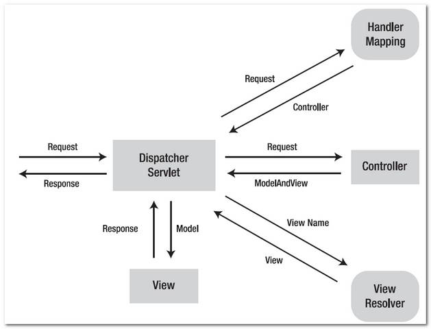

## URL Mapping

프로토콜 : 서버와 클라이언트간 통신을 위한 약속 (생략 시 http)

도메인 주소(IP 주소) : IP 주소는 숫자로 되어 있고, 사람이 이해하기 쉽게 도메인 주소를 사용함

포트번호 : 1부터 65535번까지 구성, 기본은 80

Context Path : Servlet/JSP 에서 첫 번째 경로, 한 서버에서 각 웹 앱을 구분하기 위해 지정되는 이름으로 폴더 이름이 Context path다. 

@RequestMapping : 요청 주소 매핑 처리

요청 주소를 세팅, 요청 방식도 설정 가능

```java
@RequestMapping(value = "/test1", method = RequestMethod.GET)

// 아래와 같이 동시 설정 가능
@RequestMapping(value = "/test1", method = RequestMethod.GET, RequestMthod.POST)
```

요청 방식으로 @GetMapping, @PostMapping 등도 사용 가능

## 파라미터 추출

클라이언트 요청 시 전달하는 파라미터를 쉽게 주입받을 수 있게 다양한 방법이 있음

1. HttpServletRequest 사용
    
    파라미터를 추출할 때 HttpServletRequest 객체를 통하게 되는데 이 객체를 주입 받아 사용
    
    ```java
    	@RequestMapping(value = "/test1", method = RequestMethod.GET)
    	public String test1(HttpServletRequest request) {
    		
    		String data1 = request.getParameter("data1");
    		String data2 = request.getParameter("data2");
    		String[] data3 = request.getParameterValues("data3");
    		
    		System.out.println("data1 : " + data1);
    		System.out.println("data2 : " + data2);
    		
    		for (String str1 : data3) {
    			System.out.println("data3 : " + str1);
    		}
    		
    		return "result";
    	}
    ```
    
2. WebRequest 사용
    
    1과 비슷한데 좀 더 기능이 많다고 함
    
    ```java
    	@RequestMapping(value = "/test1", method = RequestMethod.GET)
    	public String test1(WebRequest request) {
    		
    		String data1 = request.getParameter("data1");
    		String data2 = request.getParameter("data2");
    		String[] data3 = request.getParameterValues("data3");
    		
    		System.out.println("data1 : " + data1);
    		System.out.println("data2 : " + data2);
    		
    		for (String str1 : data3) {
    			System.out.println("data3 : " + str1);
    		}
    		
    		return "result";
    	}
    ```
    
3. @PathVariable
    
    데이터가 요청 주소에 있을 때 값을 주입 받을 수 있음
    
    REST API에서 많이 사용 - 요청주소/값1/값2/값3
    
    ```java
    	@GetMapping(value = "/test4/{data1}/{data2}/{data3}", method = RequestMethod.GET)
    	public String test4(@PathVariable int data1, 
    											@PathVariable int data2, 
    											@PathVariable int data3) {
    }
    ```
    
4. @RequestParam
    
    파라미터 데이터를 직접 주입 받음, 지정된 변수의 이름과 파라미터 이름이 같아야 함
    
    가능한 형 변환도 처리됨
    
    value : 파라미터의 이름과 변수의 이름이 다를 경우 파라미터 이름을 지정
    
    required : false를 설정하면 지정된 이름의 파라미터가 없을 경우 null이 주입된다. 
    
    (혹은 default value 설정 가능)
    
    ```java
    	@GetMapping(value = "/test5", method = RequestMethod.GET)
    	public String test5(@RequestParam int data1, 
    											@RequestParam int data2,
    											@RequestParam int data3) {
    }
    ```
    

## 객체로 파라미터 주입받기

1. Map으로 주입 받기
    
    전달되는 모든 파라미터 데이터를 한 번에 Map으로 받을 수 있음
    
    단, 동일명으로 전달되는 2개 이상의 파라미터는 하나만 담기게 된다.
    
    동일명으로 전달되는 파라미터가 2개 이상이라면 List로 주입받아야 한다.
    
    ```java
    	@GetMapping("/test1")
    	public String test1(@RequestParam Map<String, String> map) {
    		
    		String data1 = map.get("data1");
    		String data2 = map.get("data2");
    		
    		System.out.printf("data1:  %s\n", data1);
    		System.out.printf("data2:  %s\n", data2);
    		
    		return "result";
    	}
    ```
    
2. @ModelAttribute
    
    파라미터를 객체로 주입받을 수 있다. 
    
    전달되는 파라미터의 이름과 동일한 프로퍼티에 자동으로 주입된다.
    
    생략이 가능하며 이런 객체를 Comamnd Object라고 부른다.
    
    ```java
    	@GetMapping("/test1")
    	public String test1(@ModelAttribute DataBean bean1) {
    	}
    ```
    

## ViewResolver

- MVC



1. 클라이언트 요청을 Dispatcher Servlet이 받음
2. Dispatcher Servlet는 필요한 로직에 해당하는 Controller를 찾아서 전달함
3. Controller는 어떤 데이터를 전달할지 어떤 뷰를 사용할지를 객체에 담아서 그걸 Dispatcher Servlet에 전달함(ModelAndView 전달 - Requst 객체)
4. Dispatcher Servlet는 거기서 View name을 꺼내 ViewResolver에게 전달함
5. ViewResolver는 그 데이터를 분석해 JSP를 선택하고 View라는 객체를 만들어 다시 전달함
6. Dispatcher Servlet는 request 객체를 바탕으로 JSP를 완성해 다시 클라이언트로 전달함

HttpServletRequest

- jsp 처리할 때 HttpServletRequest 객체를 jsp로 전달함
- ViewResolver가 이걸 받아서 데이터를 사용할 수 있음

Model

- Model 객체를 주입 받아 세팅하면 HttpServletRequest 객체에 담겨 이를 JSP에 전달할 수 있다.

ModelAndView

- Model에 값을 세팅하는 기능과 View의 이름을 지정하는 기능이 있음

```java
	@GetMapping("/test1")
	public String test1() {
		
		return "test1";
	}

	@GetMapping("/test2")
	public String test2(HttpServletRequest request) {
		
		request.setAttribute("data1", 100);
		request.setAttribute("data2", 200);
		
		
		return "test2";
	}
	
	@GetMapping("/test3")
	public String test3(Model model) {
		
		model.addAttribute("data1", 300);
		model.addAttribute("data2", 400);
		
		
		return "test3";
	}

	@GetMapping("/test4")
	public ModelAndView test4(ModelAndView mv) {
		
		mv.addObject("data1", 500);
		mv.addObject("data2", 300);
		
		mv.setViewName("test4");
		
		return mv;
	}
```