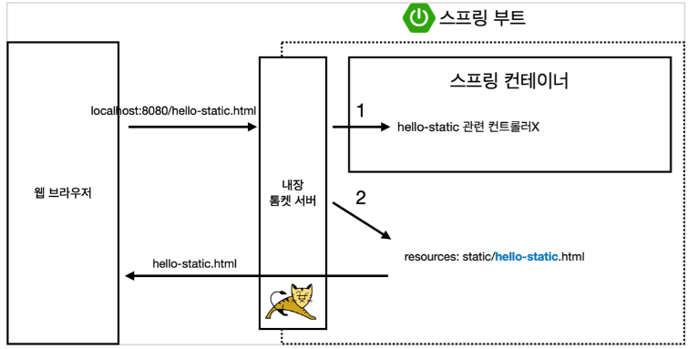
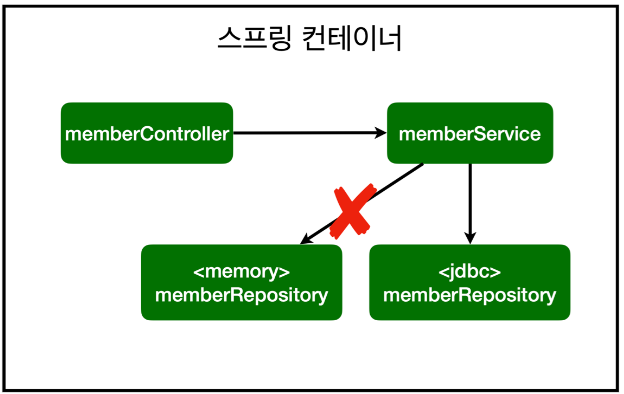
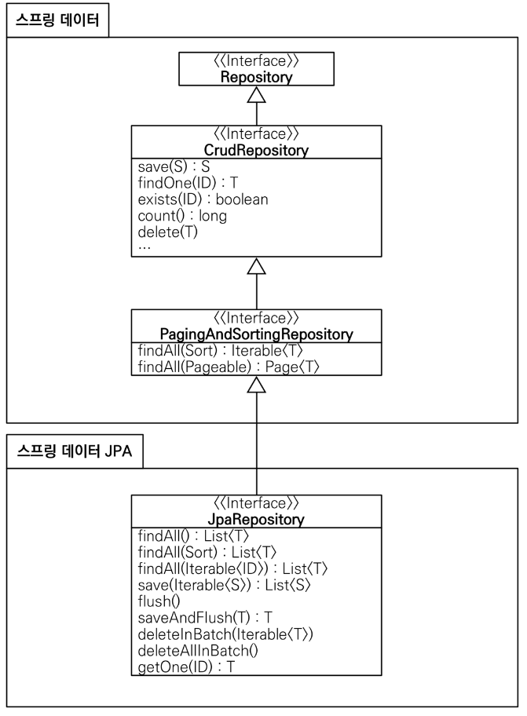
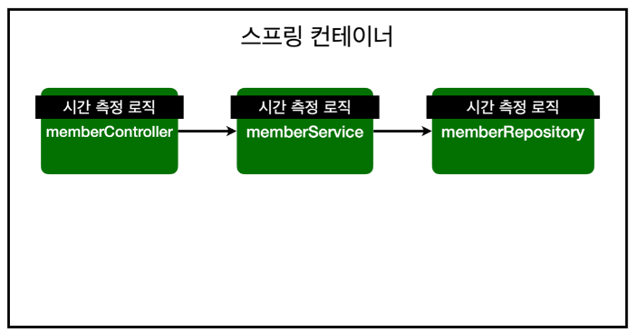
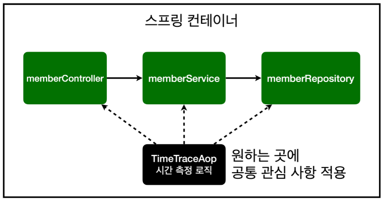
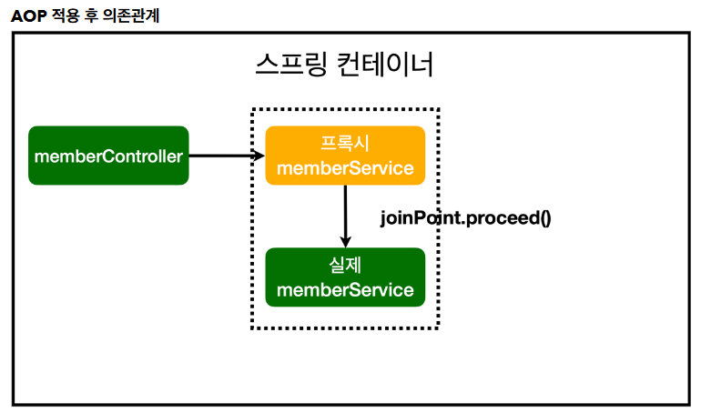
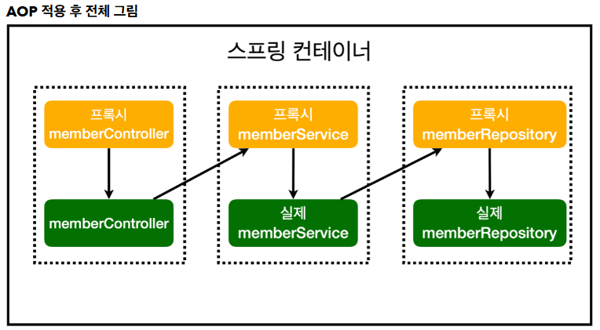

Controller가 ViewResolver에게 데이터를 넘겨서 화면을 그려줌

**@ResponseBody**

@ResponseBody 를 사용하면 뷰 리졸버( viewResolver )를 사용하지 않음

대신에 HTTP의 BODY에 문자 내용을 직접 반환(HTML BODY TAG를 말하는 것이 아님)

- viewResolver  대신에  HttpMessageConverter 가 동작
- 기본 문자처리:  StringHttpMessageConverter
- 기본 객체처리:  MappingJackson2HttpMessageConverter
- byte 처리 등등 기타 여러 HttpMessageConverter가 기본으로 등록되어 있음

Optional : 자바8에 들어간 기능으로, 반환되는 객체가 null일 가능성이 있을 때 사용한다.

(찾으려는 id나 name이 없을 수 있으므로 이런 처리를 한다)

우리 코드에서는 Member 객체를 Optional로 한 번 더 감싸서 사용할 것이다.

- Optional 변수에서 값을 꺼낼 때는 `get()`을 사용한다. (Optional객체에서 Member)

`orElseGet()` : 값이 있으면 꺼내고, 없으면 ()내의 메서드를 실행한다.

- `return Optional.ofNullable(store.get(id));`
- 아이디에 해당하는 회원이 없어 null이 나올 수 있으므로, `Optional.ofNullable()`로 감싸 준다.

## 테스트 케이스

- 테스트 클래스는 public일 필요가 없다.
- 테스트 클래스에 테스트를 원하는 객체를 생성하고, 메서드 위에 `@Test` 어노테이션을 붙이면 해당 메서드를 테스트할 수 있게 된다.
    - `import org.junit.jupiter.api.Test;`가 필요
- 테스트 메서드에서 검증을 할 때는 `org.assertj.core.api.Assertions`의 `Assertions.assertThat(member).isEqualTo(result)`와 같이 사용.
    - `import static org.assertj.core.api.Assertions.*;` 로 가져오면 Assertions 없이 사용 가능하다.
- 각 `@Test`의 순서는 보장되지 않는다.
    - 테스트는 서로 의존 관계 없이 (순서에 관계 없이) 결과가 보장되어야 함.
    - `@AfterEach` : 각 테스트메서드가 끝날 때 마다 실행하는 메서드를 정의함

### (참고) 테스트 주도 개발(TDD)

: 테스트 케이스를 먼저 만들고 기능을 만드는 것.

우리는 기능 개발을 먼저 하고 그 기능을 테스트하기 위해 테스트를 만들었지만,

테스트 주도 개발에서는 테스트를 먼저 만들고 그 테스트에 맞는 기능을 개발한다.

### given, when, then

- 무언가 주어지고 (given)
    - 테스트하는 데이터를 나타낸다.
- 어떤 로직을 실행했을 때 (when)
    - 검증하는 로직을 나타낸다.
- 결과가 이러해야 한다 (then)
    - 검증부를 나타낸다.

```java
@Test
void 회원가입() {
    // given
    
    // when
    
    // then
}
```

- try - catch 로 예외가 발생하는지 잡아내는 방법.
    - 설정한 예외를 catch문에 작성해 예외가 잘 발생하는지 확인.
    - `error.getMessage()` : 에러 메시지의 내용을 가져오는 메서드
    - `fail()` : 테스트케이스가 실패했음을 나타내는 메서드
- `assertThrows(error.class, 람다식 )` : `람다식` 을 실행했을 때 지정된`error` 가 터져야 한다. 그렇지 않으면 테스트는 실패한다.

### DI : 테스트 케이스를 위해 클래스 인스턴스를 새로 만들지 않아야 함

테스트 케이스만을 위해 클래스 인스턴스를 새로 만들면 기존 클래스와 다른 인스턴스이므로 문제가 발생할 수 있다.

- 해당 클래스의 인스턴스변수가 모두 항상 static일 수는 없다.
- 원본과 동일한 대상을 가지고 테스트해야 하는데, 다른 인스턴스를 만들어 테스트하는 상황이 된다.

→ 해결 : 클래스의 인스턴스변수 값을 `new`로 생성하지 않고, 생성자를 통해 값을 외부에서 넣도록 변경한다. 이를 **DI (Dependency Injection, 의존성 주입)** 라고 한다.

- Before
    
    `MemberService.java`
    
    ```java
    public class MemberService {
        private final MemberRepository memberRepository = new MemberRepository();
    }
    ```
    
    `MemberServiceTest.java`
    
    ```java
    class MemberServiceTest {
        MemberService memberService = new MemberService();
        MemoryMemberRepository memberRepository = new MemoryMemberRepository();
    }
    ```
    
- After
    
    `MemberService.java`
    
    ```java
    public class MemberService {
        private final MemberRepository memberRepository;
    
        public MemberService(MemberRepository memberRepository) {
            this.memberRepository = memberRepository;
        }
    }
    ```
    
    `MemberServiceTest.java`
    
    ```java
    class MemberServiceTest {
        MemberService memberService;
        MemoryMemberRepository memberRepository;
    
        @BeforeEach
        public void beforeEach() {
            memberRepository = new MemoryMemberRepository();
            memberService = new MemberService(memberRepository);
        }
    }
    ```
    

### 스프링 빈을 등록하는 2가지 방법

1. 컴포넌트 스캔과 자동 의존관계 설정 - @Controller, @Autowired, @Service, @Repository
    - @Component  애노테이션이 있으면 스프링 빈으로 자동 등록된다.
    - @Controller  컨트롤러가 스프링 빈으로 자동 등록된 이유도 컴포넌트 스캔 때문이다.
    - @Component 를 포함하는 다음 애노테이션도 스프링 빈으로 자동 등록된다.
2. 자바 코드로 직접 스프링 빈 등록하기
    - @Controller는 사용해야 하고 나머지 어노테이션을 지움
    - @Configuration 과 함께 @Bean으로 주입
    
    ```java
    package hello.hellospring;
    
    import hello.hellospring.repository.MemberRepository;
    import hello.hellospring.repository.MemoryMemberRepository;
    import hello.hellospring.service.MemberService;
    import org.springframework.context.annotation.Bean;
    import org.springframework.context.annotation.Configuration;
    
    @Configuration
    public class SpringConfig {
    
        @Bean
        public MemberService memberService() {
            return new MemberService(memberRepository());
        }
    
        @Bean
        public MemberRepository memberRepository() {
            return new MemoryMemberRepository();
        }
    }
    ```
    

### 참고

스프링은 스프링 컨테이너에 스프링 빈을 등록할 때, 기본으로 싱글톤으로 등록한다(유일하게 하나만 등록해서 공유한다). 따라서 같은 스프링 빈이면 모두 같은 인스턴스다. 설정으로 싱글톤이 아니게 설정할 수 있지만, 특별한 경우를 제외하면 대부분 싱글톤을 사용한다.

- XML로 설정하는 방식도 있지만 최근에는 잘 사용하지 않으므로 생략한다.
- DI에는 필드 주입, setter 주입, 생성자 주입 이렇게 3가지 방법이 있다. 의존관계가 실행중에 동적으로 변하는 경우는 거의 없으므로 **생성자 주입을 권장**한다.
- 실무에서는 주로 정형화된 컨트롤러, 서비스, 리포지토리 같은 코드는 컴포넌트 스캔을 사용한다.
- 정형화 되지 않거나, 상황에 따라 구현 클래스를 변경해야 하면 설정을 통해 스프링 빈으로 등록한다.

### 주의

- @Autowired 를 통한 DI는  helloConroller,  memberService 등과 같이 스프링이 관리하는 객체에서만 동작한다. 스프링 빈으로 등록하지 않고 내가 직접 생성한 객체에서는 동작하지 않는다.

### 참고

컨트롤러가 정적 파일보다 우선순위가 높다.

(스프링 컨테이너를 먼저 뒤진 후에 static 파일을 뒤짐)



스프링의 DI를 활용해 기존 코드 수정 없이 설정만으로 구현 클래스 변경 가능



**개방-폐쇄 원칙(OCP, Open-Closed Principle)**

확장에는 열려있고, 수정, 변경에는 닫혀있다.

스프링의 DI (Dependencies Injection)을 사용하면 기존 코드를 전혀 손대지 않고, 설정만으로 구현

클래스를 변경할 수 있다.

통합 테스트

@SpringBootTest - 스프링 컨테이너와 테스트를 함께 실행

@Transactional - 테스트 시작 전에 트랜잭션을 시작하고, 테스트 완료 후에 항상 롤백한다. 이렇게 하면 DB에 데이터가 남지 않으므로 다음 테스트에 영향을 주지 않는다 → 고로 계속 테스트 가능, 비워주는 코드 작성할 필요 없음

```java
private final JdbcTemplate jdbcTemplate;
    
		@Autowired
		public JdbcTemplateMemberRepository(DataSource dataSource) {
        jdbcTemplate = new JdbcTemplate(dataSource);
    }
```

스프링 데이터 JPA가 SpringDataJpaMemberRepository 를 스프링 빈으로 자동 등록해준다.



**스프링 데이터 JPA 제공 기능**

- 인터페이스를 통한 기본적인 CRUD
- findByName() ,  findByEmail()  처럼 메서드 이름 만으로 조회 기능 제공
- 페이징 기능 자동 제공

### 참고

실무에서는 JPA와 스프링 데이터 JPA를 기본으로 사용하고, 복잡한 동적 쿼리는 Querydsl이라는 라이브러리를 사용하면 된다. Querydsl을 사용하면 쿼리도 자바 코드로 안전하게 작성할 수 있고, 동적

쿼리도 편리하게 작성할 수 있다. 이 조합으로 해결하기 어려운 쿼리는 JPA가 제공하는 네이티브 쿼리를 사용하거나, 앞서 학습한 스프링 JdbcTemplate를 사용하면 된다.

# AOP

AOP가 필요한 상황

- 모든 메소드의 호출 시간을 측정하고 싶다면?
- 공통 관심 사항(cross-cutting concern) vs 핵심 관심 사항(core concern)
- 회원 가입 시간, 회원 조회 시간을 측정하고 싶다면?



AOP 적용

AOP: Aspect Oriented Programming

공통 관심 사항(cross-cutting concern) vs 핵심 관심 사항(core concern) 분리



```java
@Component
@Aspect
public class TimeTraceAop {
    
		@Around("execution(* hello.hellospring..*(..))")
    public Object execute(ProceedingJoinPoint joinPoint) throws Throwable {
        

				long start = System.currentTimeMillis();
        
				System.out.println("START: " + joinPoint.toString());
        
				try {
            return joinPoint.proceed();
        } finally {
            long finish = System.currentTimeMillis();
            long timeMs = finish - start;
            
						System.out.println("END: " + joinPoint.toString()+ " " + timeMs + 
"ms");
        }
    }
}
```





**문제**

회원가입, 회원 조회에 시간을 측정하는 기능은 핵심 관심 사항이 아니다.

시간을 측정하는 로직은 공통 관심 사항이다.

시간을 측정하는 로직과 핵심 비즈니스의 로직이 섞여서 유지보수가 어렵다.

시간을 측정하는 로직을 별도의 공통 로직으로 만들기 매우 어렵다.

시간을 측정하는 로직을 변경할 때 모든 로직을 찾아가면서 변경해야 한다.

**해결**

회원가입, 회원 조회등 핵심 관심사항과 시간을 측정하는 공통 관심 사항을 분리한다.

시간을 측정하는 로직을 별도의 공통 로직으로 만들었다.

핵심 관심 사항을 깔끔하게 유지할 수 있다.

변경이 필요하면 이 로직만 변경하면 된다.

원하는 적용 대상을 선택할 수 있다.